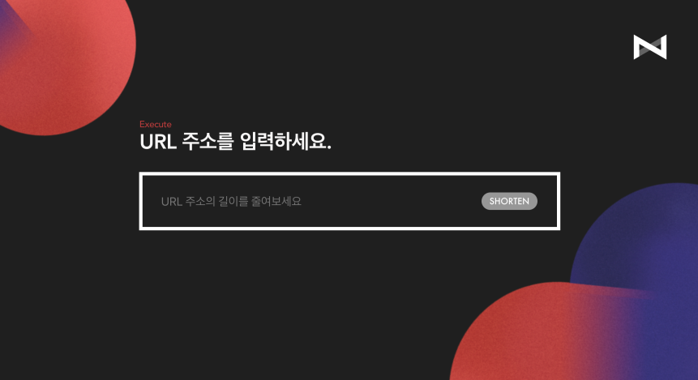

# chopchop-frontend(nexters.me)

['nexters.me'](https://www.nexters.me) is web application featured with shortening long-long URL with simple domain 'nexters.me/oo'.



## Project Stack

- Vue
- Vuex
- Vue-router
- Vue-chartjs
- date-fns
- axios

### Getting Started with Dev Mode

#### 1. install package

```
npm install
```

#### 2. run webpack dev server

```
npm run serve
```

### Making Bundle

```
npm run build
```
